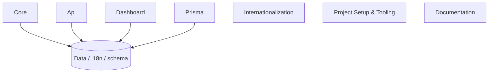

# Module diagram

```mermaid
graph TD
  F0["Core"]
  F1["Api"]
  F2["Dashboard"]
  F3["Prisma"]
  F4["Internationalization"]
  F5["Project Setup & Tooling"]
  F6["Documentation"]
  DATA[("Data / i18n / schema")]
  F0 --> DATA
  F1 --> DATA
  F2 --> DATA
  F3 --> DATA
```
